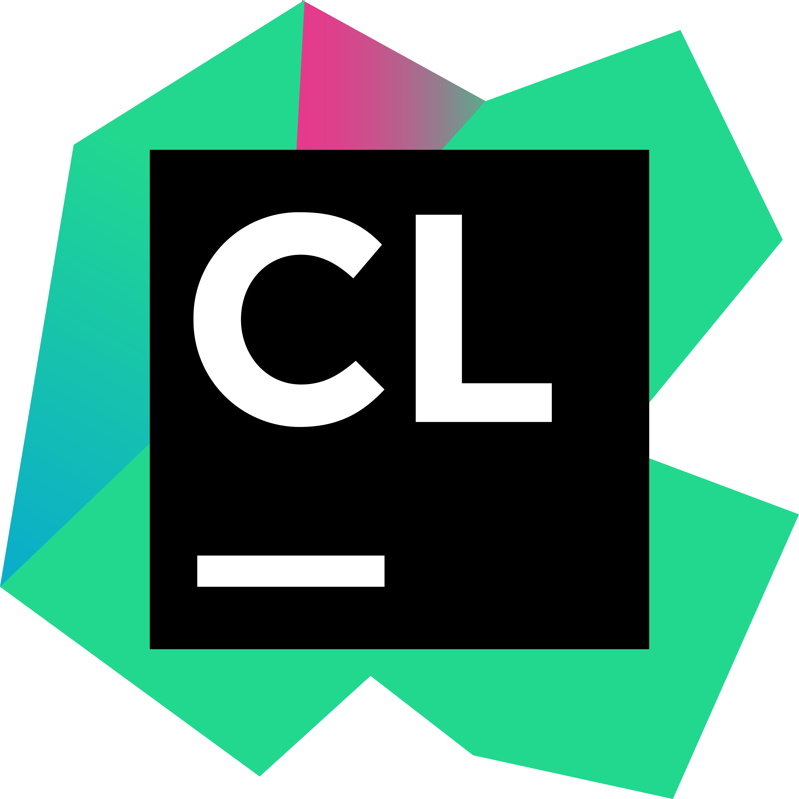

# 💫 Sobre mim:

💼 Experiência Profissional:

1. Senac DN (Departamento Nacional)
   - Atuação como Assessor Técnico III (Análise de Sistemas);
   - 05/2025 até atual;

3. Grupo Iter:
    - Atuação como Desenvolvedor de Sistemas Backend (.Net);
    - 12/2023 até 05/2025;

4. 2Flex Telecom:
    - Atuação como Analista e Desenvolvedor de Sistemas (Angular e .Net);
    - 02/2023 até 11/2023;

5. Tardis Tecnologia:
    - Atuação como Analista e Desenvolvedor de Sistemas (Angular e .Net);
    - 05/2022 até 02/2023;

📰 Resumo:

1. Analista e Desenvolvedor de Sistemas, graduado em Análises e Desenvolvimento de Sistemas pelo Serviço Nacional de Aprendizagem do Comércio (SENAC - FATEC) com ênfase em Engenharia de Software. 
Tenho mais de 3 anos de atuação no mercado, com experiência em criação de APIs usando ASP.NET Core e construção de interfaces com o Framework Angular. Minha trajetória inclui a contribuição em projetos ágeis, com a cultura SCRUM e tradicionais, com a cultura WATERFALL. Possuo habilidades em C, C++, C#, .Net, UML, Angular, TypeScript, JavaScript, Docker, Git. 
Além de minhas habilidades técnicas, compartilho meu conhecimento e experiência por meio da redação de artigos na plataforma Medium, proporcionando insights à comunidade de Software.

## 🎯 Objetivos de Carreira:

1. Médio Prazo:
    - Ingressar em um mestrado acadêmico com foco em engenharia de software / arquitetura de software;
        
2. Longo Prazo:
    - Alcançar o cargo de arquiteto de software / professor universitário;
        
3. Geral:
    - Continuar envolvido em todas as fases do ciclo de vida do software, desde a concepção até a implementação, focando em backend; 

## 🎓 Formação:

1. Graduado em Análises e Desenvolvimento de Sistemas pelo Serviço Nacional de Aprendizagem do Comércio (SENAC -
   FATEC);

## 🛠 Habilidades Técnicas:

1. Engenharia de Software:
    - Uml (Diagrama de Casos de Uso, Diagrama de Classes, Diagrama de Pacotes, Diagrama de Sequência);
    - Requisitos Funcionais;
    - Requisitos Não Funcionais;
    - Regras de Negócio;
2. Frontend:
    - Framework (Angular (Protractor, Jasmine, Formulários avançados));
    - Linguagem de Programação (TypeScript, JavaScript);
3. Backend:
    - Plataforma / Framework (.Net (Asp.Net Core (Entity Framework, Dapper )));
    - Linguagem de Programação (C, C++, C#);
    - Arquitetura / Design Patters (Arquitetura Limpa, Arquitetura Hexagonal, SOLID);
    - Documentação (Swagger);
4. Banco de Dados:
    - Relacional (MySql, SqlServer);
    - Não Relacional(MongoDb);
5. Utilitários:
    - Plataforma (Docker, Docker Compose);
    - Sistema Operacional (Linux (Ubuntu, Fedora, Debian));
    - Ide (Visual Studio, Visual Studio Code, CLion, Rider, Webstorm, Datagrip);

## 📚 Currículo Lattes:

- http://lattes.cnpq.br/7038122407102919

## 🌐 Socials:

 

# 💻 Tech Stack:

[//]: # (![C#]&#40;https://img.shields.io/badge/c%23-%23239120.svg?style=for-the-badge&logo=c-sharp&logoColor=white&#41; ![C]&#40;https://img.shields.io/badge/c-%2300599C.svg?style=for-the-badge&logo=c&logoColor=white&#41; ![C++]&#40;https://img.shields.io/badge/c++-%2300599C.svg?style=for-the-badge&logo=c%2B%2B&logoColor=white&#41; ![Azure]&#40;https://img.shields.io/badge/azure-%230072C6.svg?style=for-the-badge&logo=azure-devops&logoColor=white&#41; ![AWS]&#40;https://img.shields.io/badge/AWS-%23FF9900.svg?style=for-the-badge&logo=amazon-aws&logoColor=white&#41; ![.Net]&#40;https://img.shields.io/badge/.NET-5C2D91?style=for-the-badge&logo=.net&logoColor=white&#41; ![Angular]&#40;https://img.shields.io/badge/angular-%23DD0031.svg?style=for-the-badge&logo=angular&logoColor=white&#41; ![MicrosoftSQLServer]&#40;https://img.shields.io/badge/Microsoft%20SQL%20Sever-CC2927?style=for-the-badge&logo=microsoft%20sql%20server&logoColor=white&#41; ![MongoDB]&#40;https://img.shields.io/badge/MongoDB-%234ea94b.svg?style=for-the-badge&logo=mongodb&logoColor=white&#41; ![MySQL]&#40;https://img.shields.io/badge/mysql-%2300f.svg?style=for-the-badge&logo=mysql&logoColor=white&#41; ![Redis]&#40;https://img.shields.io/badge/redis-%23DD0031.svg?style=for-the-badge&logo=redis&logoColor=white&#41; ![GIT]&#40;https://img.shields.io/badge/Git-fc6d26?style=for-the-badge&logo=git&logoColor=white&#41; ![LINUX]&#40;https://img.shields.io/badge/Linux-FCC624?style=for-the-badge&logo=linux&logoColor=black&#41; ![TypeScript]&#40;https://img.shields.io/badge/typescript-%23007ACC.svg?style=for-the-badge&logo=typescript&logoColor=white&#41; ![JavaScript]&#40;https://img.shields.io/badge/javascript-%23323330.svg?style=for-the-badge&logo=javascript&logoColor=%23F7DF1E&#41; ![Xamarin]&#40;https://img.shields.io/badge/Xamarin-3199DC?style=for-the-badge&logo=xamarin&logoColor=white&#41; ![RxJS]&#40;https://img.shields.io/badge/rxjs-%23B7178C.svg?style=for-the-badge&logo=reactivex&logoColor=white&#41; ![Nginx]&#40;https://img.shields.io/badge/nginx-%23009639.svg?style=for-the-badge&logo=nginx&logoColor=white&#41; ![Jenkins]&#40;https://img.shields.io/badge/jenkins-%232C5263.svg?style=for-the-badge&logo=jenkins&logoColor=white&#41; ![Docker]&#40;https://img.shields.io/badge/docker-%230db7ed.svg?style=for-the-badge&logo=docker&logoColor=white&#41; ![Notion]&#40;https://img.shields.io/badge/Notion-%23000000.svg?style=for-the-badge&logo=notion&logoColor=white&#41; ![Postman]&#40;https://img.shields.io/badge/Postman-FF6C37?style=for-the-badge&logo=postman&logoColor=white&#41; ![Swagger]&#40;https://img.shields.io/badge/-Swagger-%23Clojure?style=for-the-badge&logo=swagger&logoColor=white&#41; ![Kubernetes]&#40;https://img.shields.io/badge/kubernetes-%23326ce5.svg?style=for-the-badge&logo=kubernetes&logoColor=white&#41; ![Jira]&#40;https://img.shields.io/badge/jira-%230A0FFF.svg?style=for-the-badge&logo=jira&logoColor=white&#41; ![CMake]&#40;https://img.shields.io/badge/CMake-%23008FBA.svg?style=for-the-badge&logo=cmake&logoColor=white&#41;)
<section id="l-section">
      

            
            
            
      

      

            
            
            
            
       

      

       
            
            
            
            
      

      

            
            
            
            
            
            
            
      

</section>

# 📊 GitHub Stats:

 
 

## 🏆 GitHub Trophies

### ✍️ Random Dev Quote

### 🔝 Top Contributed Repo

---

<!-- Proudly created with GPRM ( https://gprm.itsvg.in ) -->
